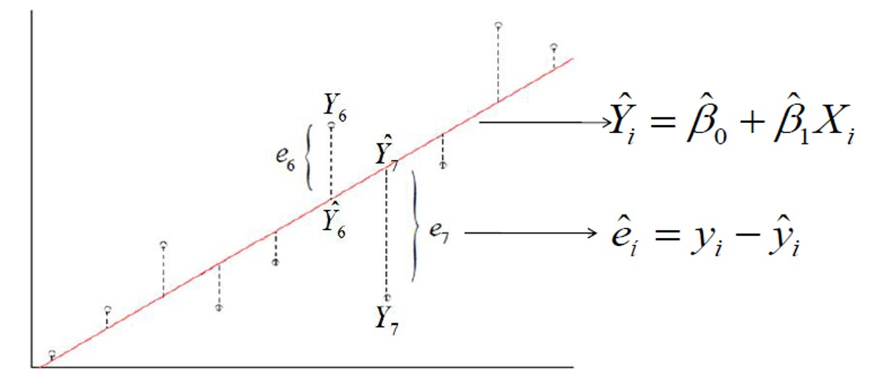

class: middle
background-image: url("images/5.png")
background-size: cover


.pull-left-narrow[


]

.pull-right-wide[

# Análitica Predictiva
----

]


---

# Análisis de regresión lineal

<br>

El objetivo del análisis de regresión es el de construir una función que aproxime de la mejor manera el comportamiento de una variable aletoaria $(Y)$ a través del conocimiento previo del valor de una variable explicativa $(X)$, mediante una expresión lineal como la siguiente:

<br>

.font180[$$Y = \beta_0 + \beta_1X$$]

<br>

> - Y: es llamada la variable de respuesta o dependiente
> - X: es llamada la variable predictora o independiente
> - $\beta_0$: es el intercepto de la linea con el eje $Y$
> - $\beta_1$: es la pendiente de la linea de regresión


---

class: center

## Este modelo supone una **asociación lineal** entre las variables de estudio, por tanto antes de empezar, esta relación debe ser valorada


.pull-left[

```{r, warning=FALSE, echo=FALSE, message=FALSE, fig.height=5}


retail_data <- mtcars %>%
  rename(
    sales_performance = mpg,
    product_category = cyl,
    product_size = disp,
    product_popularity = hp,
    profit_margin = drat,
    inventory_cost = wt,
    delivery_speed = qsec,
    product_lifespan = vs,
    sales_channel = am,
    supplier_diversity = gear,
    discount_frequency = carb
  )

# Verificar los nombres actualizados
#colnames(retail_data)

# Seleccionar solo las variables cuantitativas
retail_data_quant <- select(retail_data, sales_performance, product_size, 
                            product_popularity, profit_margin, 
                            inventory_cost, delivery_speed, 
                            supplier_diversity, discount_frequency)

# Graficar relación entre inventory_cost y sales_performance
plot(retail_data_quant$product_size, retail_data_quant$sales_performance, 
     main = "Relación entre Tamaño de producto y No. Ventas promedio",
     xlab = "Tamaño de producto cm3", ylab = "No. Ventas promedio")

# Calcular la correlación entre inventory_cost y sales_performance
#cor(retail_data_quant$product_size, retail_data_quant$sales_performance)


# cor(iris$Petal.Length,iris$Petal.Width)


```


.center[Correlación entre `Tamaño del producto` y `No. Ventas promedio` es -0.84. 

]


]


.pull-right[

```{r, warning=FALSE, echo=FALSE, message=FALSE, fig.height=6.5}

library(ggcorrplot)

cor_matrix <- cor(retail_data_quant)
ggcorrplot(cor_matrix, lab = TRUE, type = "lower", title = "Matriz de Correlación")


```


]


---


name: MCO
class: center, middle

# `r icon("database")`
# Mínimos cuadrados ordinarios
----


---


# MCO


.font140[En el análisis de regresión lineal el objetivo es utilizar los datos para trazar una línea que represente mejor la relación entre dos variables.]

.pull-left[

.center[

### Ya que se puede trazar más de una recta que razonablemente se ajuste a la distribución de los datos, es preferible utilizar el método de los **mínimos cuadrados** que resulta en una sola y mejor línea de regresión *.orange[(Recta del mejor ajuste)]*.
]
]

.pull-right[
<br>
.center[

]
]

> **Mínimos Cuadrados Ordinarios (MCO):** El objetivo de este procedimiento es estimar los parámetros tal que la suma de cuadrados (SC) de las diferencias entre las observaciones (valores reales) y la línea recta estimada sea mínima (Min SCError).


---

# MCO

Si lo que interesa es minimizar la suma de cuadrados del error...


.center[
### ¿Qué es el error?
]

--

.font1800[$$\hat{e}_i = y_i - \hat{y}_i$$]

### Entonces, interesa...


.pull-left[
.center[

]
]

.pull-right[

<br>
$$SCE = \sum_{i=1}^n (y_i - \hat{y}_i)^2$$
]

---


#MCO 

.font150[Una vez que se han determinado las estimaciones por MCO del intercepto y de la pendiente, se obtiene la línea de regresión de MCO.]

<br>

$$E(Y/X) = \hat{\beta_0} + \hat{\beta_1}{X}$$

$$\hat{Y} = \hat{\beta_0} + \hat{\beta_1}{X}$$

<br>
<br>

> - **El intercepto,** $\hat{\beta_0}$ es el valor predicho de Y cuando $X = 0$, aunque en algunos casos no tiene sentido hacer $X = 0$.

> - **La pendiente,** $\hat{\beta_1}$ es de primordial interés, pues indica la cantidad en la que cambia $\hat{Y}$ cuando X se incrementa en una unidad.


---


# Ejemplo en clase: .orange[Estimar]

.pull-left[

----

```{c1, warning=FALSE, message=FALSE, eval=FALSE, echo=TRUE}

modelo1 <- lm(sales_performance ~ product_size ,retail_data )
summary(modelo1)

```


----

.center[
.font110[**¿Cómo se interpreta esta ecuación?**
]]

.orange[$$\hat{Ventas} = 29.59 - 0.04 Tamaño$$]


- En este caso, el intercepto representa un .orange[**valor de ajuste**] que simplemente ayuda a formar la ecuación de la recta de regresión, pero no necesariamente tiene una interpretación.


- Luego, el cambio que se predice para las ventas en función del cambio en el tamaño se expresa como: 

$$\vartriangle \hat{Ventas} = - 0.04 (\vartriangle Tamaño)$$


]


.pull-right[

.font40[
```{c1, warning=FALSE, message=FALSE, eval=FALSE, echo=TRUE}
## Call:
## lm(formula = sales_performance ~ product_size, data = retail_data)
## 
## Residuals:
##     Min      1Q  Median      3Q     Max 
## -4.8922 -2.2022 -0.9631  1.6272  7.2305 
## 
## Coefficients:
##               Estimate Std. Error t value Pr(>|t|)    
## (Intercept)  29.599855   1.229720  24.070  < 2e-16 ***
## product_size -0.041215   0.004712  -8.747 9.38e-10 ***
## ---
## Signif. codes:  0 '***' 0.001 '**' 0.01 '*' 0.05 '.' 0.1 ' ' 1
## 
## Residual standard error: 3.251 on 30 degrees of freedom
## Multiple R-squared:  0.7183,    Adjusted R-squared:  0.709 
## F-statistic: 76.51 on 1 and 30 DF,  p-value: 9.38e-10
```
]


Indica que por cada unidad (cm3) adicional en el tamaño del producto, el número promedio de ventas se reduce en 0.041 unidades.

]


---


# Intervalos de confianza en R

.pull-left[

En particular, para nuestro ejemplo:

```{c1, warning=FALSE, message=FALSE, eval=FALSE, echo=TRUE}

modelo1 <- lm(sales_performance ~ product_size ,retail_data )

summary(modelo1)
  
confint(modelo1)

  
# Esta es la salida

                   2.5 %      97.5 %
(Intercept)  27.08843246 32.11127705
product_size -0.05083797 -0.03159227
```


]

.pull-right[

> Estamos 95% seguros de que el valor promedio de ventas para productos de tamaño muy pequeño está entre 27.09 y 32.11 unidades. .orange[*Aunque un tamaño de producto igual a cero no tiene sentido práctico, este intervalo nos da una estimación del volumen de ventas para productos de menor tamaño.*]


----

- El intervalo de confianza del 95% para el coeficiente de product_size va de -0.0508 a -0.0316.

> Estamos 95% seguros de que el efecto del tamaño del producto en el número de ventas promedio se encuentra en este rango.


]


---


# Pruebas de hipótesis


* Hasta ahora, hemos estimado los coeficientes del modelo y hemos construido intervalos de confianza para ellos.

* Pero a veces, queremos hacer una afirmación más específica sobre el valor de un coeficiente en particular.

* Es aquí donde entran las pruebas de hipótesis.

## Hipótesis nula y alternativa

Las pruebas de hipótesis implican dos hipótesis:

> * Hipótesis nula. $H_0$: afirmación sobre el valor de un parámetro poblacional
> * Hipótesis alternativa. $H_1$: afirmación que contradice $H_0$

.orange[**Ejemplo:**]

$H_0$: $\beta_1 = 0$ (no hay relación entre X e Y) 

$H_1$: $\beta_1 \neq 0$ (hay una relación entre X e Y)

---


<br>
<br>


.pull-left[

## Valor p

En lugar de establecer una región crítica, podemos utilizar el valor p para tomar una decisión.

El valor p es la probabilidad de obtener un valor del estadístico de prueba tan extremo o más extremo que el valor observado, asumiendo que la hipótesis nula es verdadera.

.orange[Si el valor p es menor que el nivel de significancia ] $\alpha$ .orange[rechazamos la hipótesis nula.]


]

.pull-right[

## Prueba del intervalo de confianza


- Estimamos el intervalo de confianza al nivel de significancia $\alpha$ para $\beta_1$ usando la fórmula ya vista.

- .orange[Si el intervalo de confianza no contiene el valor 0, entonces rechazamos la hipótesis nula] y concluimos que hay evidencia estadística para afirmar que $\beta_1$ es diferente de cero al nivel de significancia $\alpha$. 

- En caso contrario, no podemos rechazar la hipótesis nula.


]

---


# En R...


.pull-left[

`modelo1 <- lm(sales_performance ~ product_size ,retail_data )`

`summary(modelo1)`

* Dado que el *valor-p* (9.38e-10) es menor que cualquier nivel de significancia común, podemos rechazar la hipótesis nula y concluir que hay evidencia suficiente para afirmar que la variable Tamaño *(product_size)* tiene un efecto significativo en las Ventas *(sales_performance)*.

]

.pull-right[

.font70[
```{r, warning=FALSE, message=FALSE, eval=TRUE}
modelo1 <- lm(sales_performance ~ product_size ,retail_data )
summary(modelo1)
```
]

]


---


# Predicción

Una vez que se han estimado los parámetros del modelo de regresión lineal simple, podemos usar el modelo para hacer predicciones.

----

La predicción puntual de $Y$ para un valor dado de $X$ es: 

$$\hat{Y} = \hat{\beta_0} + \hat{\beta_1} X$$

----


Donde $\hat{\beta_0}$ y $\hat{\beta_1}$ son las estimaciones de los parámetros $\beta_0$ y $\beta_1$ obtenidas a partir de los datos.

.orange[Es importante tener en cuenta que la predicción puntual solo es exacta si el modelo es válido y los errores son normales e independientes.]


---


# Predicción

## Intervalo de confianza para la predicción en R


<br>

----

> .orange[**Para calcular el intervalo de confianza para la predicción,**] utilizamos la función `predict()` con el argumento `interval = "prediction"` y especificamos el nivel de confianza deseado con el argumento `level = 0.95`. Esto nos da tres columnas en la salida: la predicción puntual, el límite inferior del intervalo de confianza y el límite superior del intervalo de confianza.

----


---


# En R...


.pull-left[

.scroll-box-20[

.font70[

```{r, eval=FALSE,echo=TRUE}

# Ajustar el modelo de regresión lineal simple
model <- lm(sales_performance ~ product_size, data = retail_data)

# Crear un conjunto de valores de product_size para la predicción
newdata <- data.frame(product_size = seq(from = min(retail_data$product_size), to = max(retail_data$product_size), length.out = 100))

# Calcular la predicción y el intervalo de confianza para la predicción
pred <- predict(model, newdata = newdata, interval = "prediction", level = 0.95)


# Graficar los resultados
plot(retail_data$product_size, retail_data$sales_performance, pch = 16, xlab = "Tamaño", ylab = "Ventas")
lines(newdata$product_size, pred[, 1], lwd = 2, col = "blue")
lines(newdata$product_size, pred[, 2], lwd = 2, col = "red", lty = 2)
lines(newdata$product_size, pred[, 3], lwd = 2, col = "red", lty = 2)
legend("topright", legend = c("Predicción", "Intervalo de confianza para la predicción"),
       lty = c(1, 2, 1, 2), col = c("blue", "red"), bty = "n", cex = 0.8)

```

]
]
]


.pull-right[


```{r, echo=FALSE}

# Ajustar el modelo de regresión lineal simple
model <- lm(sales_performance ~ product_size, data = retail_data)

# Crear un conjunto de valores de product_size para la predicción
newdata <- data.frame(product_size = seq(from = min(retail_data$product_size), to = max(retail_data$product_size), length.out = 100))

# Calcular la predicción y el intervalo de confianza para la predicción
pred <- predict(model, newdata = newdata, interval = "prediction", level = 0.95)


# Graficar los resultados
plot(retail_data$product_size, retail_data$sales_performance, pch = 16, xlab = "Tamaño", ylab = "Ventas")
lines(newdata$product_size, pred[, 1], lwd = 2, col = "blue")
lines(newdata$product_size, pred[, 2], lwd = 2, col = "red", lty = 2)
lines(newdata$product_size, pred[, 3], lwd = 2, col = "red", lty = 2)
legend("topright", legend = c("Predicción", "Intervalo de confianza para la predicción"),
       lty = c(1, 2, 1, 2), col = c("blue", "red"), bty = "n", cex = 0.8)

```

]

---


# Validación de condiciones para la regresión múltiple lineal

> **Relación lineal entre los predictores numéricos y la variable respuesta:**


.pull-left[

Esta condición se puede validar bien mediante diagramas de dispersión entre la variable dependiente y cada uno de los predictores (como se ha hecho en el análisis preliminar).

]

.pull-right[

```{r, warning=FALSE, message=FALSE, eval=TRUE, echo=FALSE, fig.height=4}
plot(retail_data_quant$product_size, retail_data_quant$sales_performance, 
     main = "Relación entre Tamaño de producto y No. Ventas promedio",
     xlab = "Tamaño de producto", ylab = "Desempeño de Ventas")
```

]


---


<br>
<br>

> **Distribución normal de los errores:**


<br>
<br>


.pull-left[

> H0: Normalidad

> H1: No Normalidad


]


.pull-right[


```{r, warning=FALSE, message=FALSE, eval=TRUE, echo=TRUE, fig.height=2}

shapiro.test(model$residuals)

```

]


---


<br>
<br>

> **Variabilidad constante de los errores (homocedasticidad):**

<br>
<br>

.pull-left[


> H0: Varianza Constante

> H1: Varianza No Constante


]


.pull-right[

```{r, warning=FALSE, message=FALSE, eval=TRUE, echo=TRUE, fig.height=2}


library(lmtest)
bptest(model)


```


]


---


# Regresión con variables categóricas

.pull-left[

```{r, warning=FALSE, message=FALSE, eval=TRUE, echo=FALSE, fig.height=2}

ggplot(retail_data, aes(x = product_size, y = sales_performance, color = as.factor(sales_channel))) +
  geom_point(size=4) +
  labs(x = "Tamaño del Producto", y = "Desempeño de Ventas", color = "Canal de Venta") +
  theme_minimal() +
  theme(legend.title = element_text(size = 12),   # Tamaño de fuente para el título de la leyenda
        legend.text = element_text(size = 10))   +  # Tamaño de fuente 
scale_color_manual(values = c("blue", "red"),  # Colores para cada categoría
                     labels = c("En Línea","Tienda Física")) 

```


- El modelo de regresión ajustado es:

$$
\text{Ventas} = \beta_0 + \beta_1 \cdot \text{Tamaño} + \beta_2 \cdot \text{Canal de Venta}
$$


----

- En este modelo, hemos incluido una **variable categórica**: `sales_channel`, que toma los valores **0** y **1**.
- Esta variable representa el **canal de venta**:
  - **0**: En Línea
  - **1**: Tienda Física


]


.pull-right[


**Coeficiente de `product_size`** $\beta_1$:
 - Mide el cambio promedio en las `Ventas` por cada unidad adicional en el tamaño del producto.
   
**Coeficiente de `sales_channel`** $\beta_2$:
 - Muestra la diferencia en las `Ventas` entre el canal de venta en tienda física (1) y el canal en línea (0).


]


---


# Regresión con variables categóricas

.pull-left[

```{r, warning=FALSE, message=FALSE, eval=TRUE, echo=FALSE, fig.height=2}

modelo2 <- lm(sales_performance ~ product_size +as.factor(sales_channel),
              retail_data )

summary(modelo2)

# Resultado:

## lm(formula = sales_performance ~ product_size + as.factor(sales_channel), 
##     data = retail_data)
## 
## Residuals:
##     Min      1Q  Median      3Q     Max 
## -4.6382 -2.4751 -0.5631  2.2333  6.8386 
## 
## Coefficients:
##                            Estimate Std. Error t value Pr(>|t|)    
## (Intercept)               27.848081   1.834071  15.184 2.45e-15 ***
## product_size              -0.036851   0.005782  -6.373 5.75e-07 ***
## as.factor(sales_channel)1  1.833458   1.436100   1.277    0.212    
## ---
## Signif. codes:  0 ‘***’ 0.001 ‘**’ 0.01 ‘*’ 0.05 ‘.’ 0.1 ‘ ’ 1
## 
## Residual standard error: 3.218 on 29 degrees of freedom
## Multiple R-squared:  0.7333,	Adjusted R-squared:  0.7149 
## F-statistic: 39.87 on 2 and 29 DF,  p-value: 4.749e-09  
  

```


]


.pull-right[

> **El coeficiente de 1.83** sugiere que el canal físico tiende a tener un promedio de ventas 1.83 unidades mayor que el canal en línea.

----


> Sin embargo, **el valor de p = 0.212** indica que esta diferencia no es estadísticamente significativa al nivel de 0.05, por lo que no hay suficiente evidencia para afirmar que el canal de venta afecta el desempeño de ventas de forma significativa.


]


